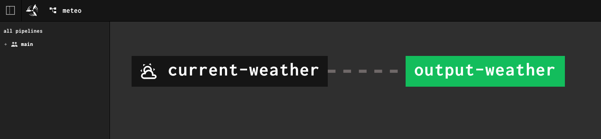

# Weather Concourse Resource

A simple Concourse-resource that fetch the Weather from <https://open-meteo.com/> at a given latitude and longitude.

Publicly available on [Docker Hub](https://hub.docker.com/r/jimetevenard/weather-concourse-resource),
so any Concourse-CI instance should be able to use it !



## Usage

Use it in a pipeline

````yaml
resource_types:
- name: weather-resource
  type: registry-image
  source:
    repository: jimetevenard/weather-concourse-resource
    tag: latest

resources:
- name: current-weather
  type: weather-resource
  icon: weather-partly-cloudy
  source:
    latitude: 48.84 # Example :
    longitude: 2.42 # Saint-Mandé, France

jobs:
- name: output-weather
  plan:
  - get: current-weather
  - task: echo-weather
    config:
      platform: linux
      image_resource:
        type: registry-image
        source:
          repository: alpine
      inputs:
      - name: current-weather
      run:
        path: cat
        args: 
        - current-weather/weather.json
````

## Endpoints

### `opt/resource/in` endpoint

Outputs a `weather.json`file of the following format :

````json
{
    "weathercode":3,
    "time":"2023-01-26T18:00",
    "good":true
}
````

the `good` field will be set to `true` if the current weather at the
given geoPoint is "nice" (i.e. clear or cloudy but without rain)

_More precisely, if the `weathercode`is equal to `0`, `1`, `2`or `3`._

See <https://open-meteo.com/en/docs#weathervariables> for more info
about the meaning of weather codes.

### `opt/resource/check` endpoint

Will pass to `stdout` a JSON singleton list of `{"time":"..."}` objects
whose single value will correspond to the _time_ returned by open-meteo API.

This weather API has an update time of *an hour*.

So, the resource will be considered as _updated_ by Concourse-CI every hour.

The `check_every` concourse param should be aligned with this
duration to avoid unnecessary calls to the API.

### `opt/resource/out` endpoint

This stateless resource can't be updated in any way.

This endpoint will exit in failure in every case.

## Miscellaneous

### Local testing with Docker

See <https://concourse-ci.org/implementing-resource-types.html#test-resource-with-docker>

You can use Docker to run a container "like concourse would do"

Create a `input.json` in some random directory of your machine :

It mimics the JSON that Concourse will send through `stdin` if the above pipeline sample is used (the `version.time` will, of course, be different)

````json
{
  "source": {
    "latitude": 48.84,
    "longitude": 2.42
  },
  "version": {
    "time": "2023-01-26T17:00"
  }
}
````

#### Testing `check` :

````sh
docker run --rm -i -v "${PWD}:${PWD}" -w "${PWD}" test /opt/resource/check < input.json
````

Should output (`stdout`) something like : `[{"time": "2023..."}]`

#### Testing `in` :

````sh
docker run --rm -i -v "${PWD}:${PWD}" -w "${PWD}" test /opt/resource/in . < input.json
````

Should create a `weather.json` file in your current working directory (see the `-v` option in the above command)

And also output (`stdout`) something like : `{"version": { "time":  "2023..." }, "metadata": []}`

#### Testing `out` :

````sh
docker run --rm -i -v "${PWD}:${PWD}" -w "${PWD}" test /opt/resource/out < input.json
````

Should always fail and output (`stderr`) the folling message  : `This resource does not implements 'out' endpoint`